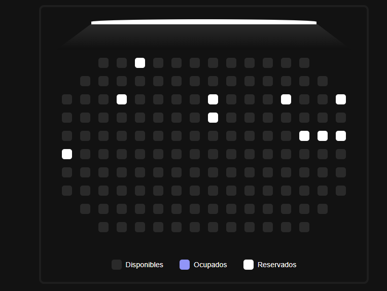
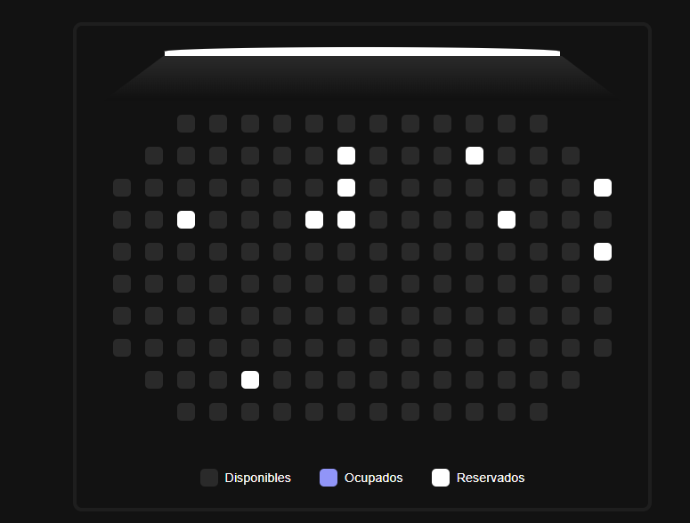
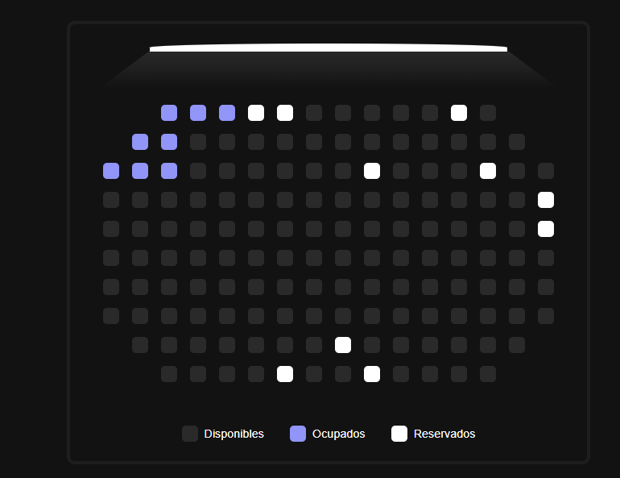

| Coursera
---
# Seat Selector UI
Una interfaz interactiva para seleccionar asientos en distintas ubicaciones de la pantalla simulando una sala de cine/teatro.

## Tecnologías
- HTML
- CSS
- JavaScript (Vanilla)

## Imagenes

---
